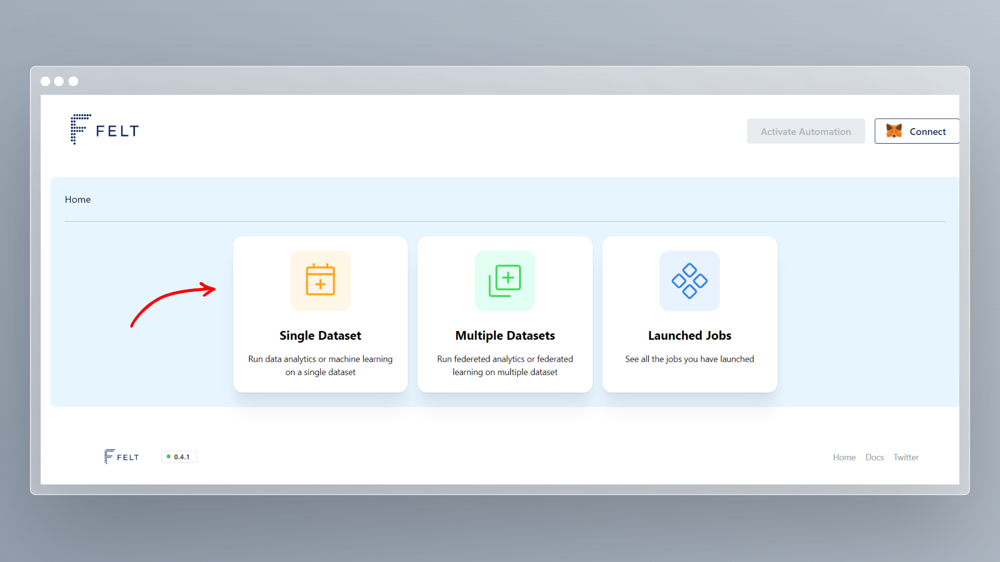

# Getting Started

In this guide, we will use a sample problem to go over all steps necessary for federated learning with FELT. This process consists of:

1. Initial setup
2. Preparing datasets
3. Starting local training
4. Aggregating results from local training
5. Using final model


Video tutorial following similar structure as this guide.


## Initial Setup

### Connecting MetaMask

Right now the application only works with MetaMask wallet. Without MetaMask you can only view already existing projects. For instructions how to install MetaMask please visit:


Follow the instuctions here to obtain MetaMask


Once you have the MetaMask installed, you can head to the FELToken application:



Here in top-right corner you should see **CONNECT** button with MetaMask icon. Make sure that `Polygon Mumbai` is selected in the MetaMask and click connect. After that you just need to approve the connection in the MetaMask pop-up window.

_In case you don't have `Polygon Mumbai` network in your MetaMask, you can add it by following_ [_this guide_](https://docs.polygon.technology/docs/develop/metamask/config-polygon-on-metamask/)_._

### Transaction Fees

Right now the app is deployed on Polygon Mumbai testnet. First you will need some MATIC tokens to pay for the transaction fees. You can obtain these using Polygon faucet. Just visit following link and paste your wallet address:


Head to this site to obtain MATIC tokens for paying transaction fees.


You will also need OCEAN tokens to pay for datasets and algorithms. You can collect them through OCEAN faucet by submitting your wallet address here:



## Preparing datasets

For the demonstration of federated learning, let’s image two towns collaborating on analysing housing data. The data might contain sensitive information. Therefore, they can’t fully disclose the data. Each town publishes its dataset on Ocean, allowing only computation over data without direct access. **We will try to predict a house price based on house parameters** (size in square feet, number of bedrooms, bathrooms, material, etc.). Below you can see a demonstration of our data ([original data file](https://github.com/ywchiu/riii/blob/cba34bb9342cb0d283b531f5dc502fc15688078a/data/house-prices.csv)).


Example of house prices dataset. The target column we want to predict (prices) is the last. In data published on Ocean, we also need to remove the header row.


We already have the data published on Ocean (using Mumbai chain) as the following assets which we will use in this guide:

* [did:op:3632e8584837f2eac04d85466c0cebd8b8cb2673b472a82a310175da9730042a](https://market.oceanprotocol.com/asset/did:op:3632e8584837f2eac04d85466c0cebd8b8cb2673b472a82a310175da9730042a)
* [did:op:cad4a81c9a8e1c1071ccf3e9dea6f8f42d58e100fa3ddf2950c8f0da9e0dda46](https://market.oceanprotocol.com/asset/did:op:cad4a81c9a8e1c1071ccf3e9dea6f8f42d58e100fa3ddf2950c8f0da9e0dda46)

### Data Format <a href="#6b53" id="6b53"></a>

For using FELT with your own data, you will first need to have data in the correct data format. Right now, we support only **CSV format**. With the following rules:

* CSV contains only numerical data
* The last column is the target column
* Remove header row from data
* All datasets used during training must have the same number of columns

You can check this file [`house-prices-part1.csv`](https://gist.github.com/Breta01/a8482d3cae0c257e9a7394ca72fdb281) which is used in this article. For more details about publishing your datasets on the Ocean marketplace, please read:




If you are using your data, don’t forget to allow the “Local Training — FELT” algorithm or just all published algorithms.


## Starting Local Training <a href="#901e" id="901e"></a>

Now when we have our data ready. It’s time to start the training! Head to the [app.feltoken.ai](https://app.feltoken.ai/). Before you begin, you will need to connect your MetaMask account. So click on **Connect** button in the top-right corner. Make sure that in MetaMask, you are connected to the correct account and Mumbai testnet.

Then you will see a short form where you must fill in the name of training (you can pick an arbitrary one). Then you fill in the DIDs of data; for our demo, you can use:

```
did:op:3632e8584837f2eac04d85466c0cebd8b8cb2673b472a82a310175da9730042a
did:op:cad4a81c9a8e1c1071ccf3e9dea6f8f42d58e100fa3ddf2950c8f0da9e0dda46
```

Finally, you will pick `Linear Regression` as the model to train.

<figure><figcaption><p>Screenshot of how the form should look before you hit Submit button.</p></figcaption></figure>

### Approving Transactions <a href="#4d63" id="4d63"></a>

Once you hit **Submit** button, you will see a progress bar. You will have to approve a few transactions using MetaMask to start the training. Here is the list of all transactions you will have to confirm:

1. Approve OCEAN token spend to purchase the dataset
2. Purchase the dataset _(now approve and purchase are separate transactions)_
3. Approve OCEAN token spend to purchase FELT algorithm for training
4. Purchase the algorithm
5. Sign request to start the compute job (training)

You have to start separate training for each DID; therefore, you will have to approve the set of the above transactions twice.

<figure><figcaption><p>Screenshot from starting training and approving transactions through MetaMask.</p></figcaption></figure>

## Starting Aggregation <a href="#78b8" id="78b8"></a>

Once you start the local training, you can go to [launched jobs page](https://app.feltlabs.ai/jobs) (you can use **Launched jobs** button). Here you can monitor the compute job progress. You have to click the **Reload** button to get the latest status. Once both jobs finish, you can start the aggregation (**Aggregate** button).

<figure><figcaption><p>Display of launched jobs; starting aggregation once local training is completed.</p></figcaption></figure>

After starting the aggregation, the progress bar will pop up. You will have to approve some transactions once again:

1. Sign URLs to access local models
2. Approve OCEAN token to pay for provider fees
3. Order dataset for the compute job
4. Approve OCEAN token spend to purchase FELT algorithm for aggregation
5. Purchase the algorithm
6. Sign request to start the compute job (aggregation)

<figure><figcaption></figcaption></figure>

## Use Final Model <a href="#93d9" id="93d9"></a>

You can watch aggregation progress. Once it finishes, you will see the **Download final model** button. You will sign the request and download the final model (in our case `final-model-House Prices.json`). The file is not a standard machine learning file format. You will have to use the FELT library to import it.

First, you have to install the [FELT python library](https://github.com/FELT-Labs/feltlabs.py) using pip (it requires **Python 3.9 or newer**):

```
pip install feltlabs==0.2.6
```

Then you can load the model using `feltlabs.model.load_model(model_path)` function. This function will take the path of the model file as an argument and return the standard [scikit-learn model](https://scikit-learn.org/stable/modules/generated/sklearn.linear\_model.LinearRegression.html) object. You can check the following code for sample usage:



That’s it. You just trained your first model on a distributed dataset! Now it’s up to your imagination to find projects where you can use this technology.

## Conclusion

These should be the main parts for getting started with the FELToken. In following guides you might find more detailed instructions for specific tasks.
