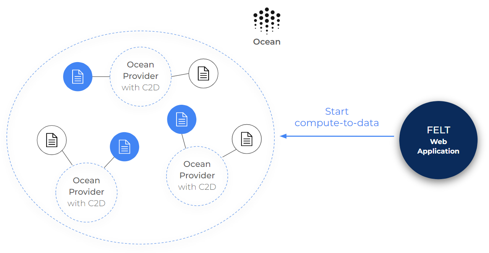

# Single or Multi Dataset Training

When opening [the FELT application](https://app.feltlabs.ai/), you will have the option to select between **single** and **multi**-dataset training. This will determine the following process of training.

<figure><figcaption>
Initial screen of FELT applicationa when selecting between single and multiple datasets option.
</figcaption></figure>

## Starting Training

The start of the training is the same for both options. The only difference is that in the case of the single dataset training, you have to provide one DID (dataset id), and for multiple datasets, you have to provide at least 2 DIDs. The rest of the training setup is the same, you will pick a model, select hyperparameters, and start training. Once the training starts, you can go to [the Launched jobs section](https://app.feltlabs.ai/jobs) of the application to view the results. That's the part where things start to differ.

## Single Dataset

When viewing the results of single dataset training. You will see only one DID with status. When the training finishes, you can download the model and use it right away. Therefore training on a single dataset is generally faster as it requires starting just one compute job to get the results.

<figure><figcaption>
Screenshot from job status for single dataset training.
</figcaption></figure>

## Multiple Datasets

The situation is different for multiple datasets training. In this case, we run compute job on each dataset separately. We call this **local training**. The results of local training can't be used directly, and you can't view them in the application. Instead, you have to select local trainings (using checkboxes on the right) and click on **aggregate**. The aggregation will combine these local jobs into the final model, which you can then download in the **Aggregation** section. If you have a lot of datasets, you can run multiple aggregations. Each job can aggregate different datasets together.

<figure><figcaption>
Status for training on multiple datasets. The results from local training have to be aggregated into the final model.
</figcaption></figure>

